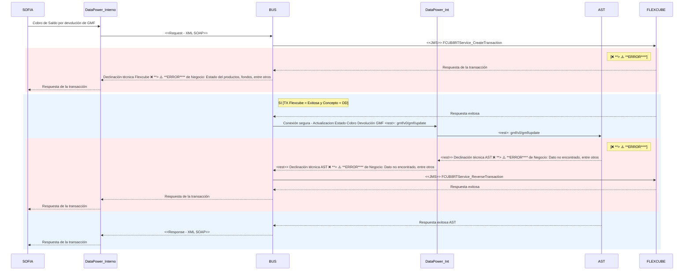
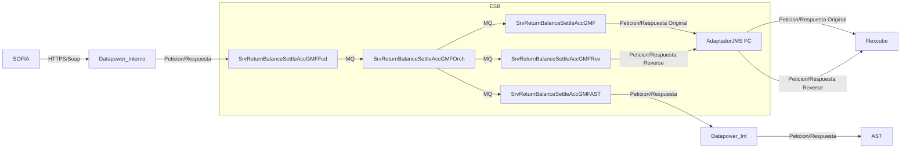

# Prompt para Análisis de Contenido de Archivos

## Rol
Analiza archivos de un repositorio para validar cumplimiento de reglas específicas.

## Proceso de Análisis

### 1. Identificación y Lectura

- Localiza bloques que inician con `TÍTULO:`
- Extrae contenido desde `CONTENIDO:` hasta el siguiente `TÍTULO:` o final del documento
- Preserva formato original (indentación, saltos de línea)
- Indentifica y analiza exhaustivamente la estructura de directorios que hay antes del contenido de los archivos


### 2. Validación

- Aplica cada regla al contenido de todos los archivos relevantes
- Documenta cumplimientos e incumplimientos con evidencia específica


## Contenido a Analizar
```
Estructura de directorios

- int-iib-fcd-SrvReturnBalanceSettleAccGMFFcd-middleware-esql
 - README.md
 - Resource
 - Config
 - `addRtnBcSettleAccGMF.xml`
 - Contract
 - ReturnBalanceSettleAccGMF.wsdl
 - MQ
 - MQSrvReturnBalanceSettleAccGMFFcd.mq
 - ReverseMQSrvReturnBalanceSettleAccGMFFcd.mq
 - VerifyMQSrvReturnBalanceSettleAccGMFFcd.mq
 - Test
 - `ReturnBalanceSettleAccGMFsoapuiproject.xml`
 - SrvReturnBalanceSettleAccGMFFcd
 - .project
 - application.descriptor
 - co
 - com
 - bancopopular
 - fcd
 - ReturnBalanceSettleAccGMFFcdWSREQ.msgflow
 - ReturnBalanceSettleAccGMFFcdWSRESP.msgflow
- int-iib-fcd-SrvReturnBalanceSettleAccGMFFcd-middleware-esql
 - EspecificacionAddReturnBalanceSettleAccGMF.md
 - Guion.md
 - Home.md
 - PruebasAddReturnBalanceSettleAccGMF.md
 - Recursos
 - DiagramaArq.png


Contenido de archivos



TITULO: int-iib-fcd-SrvReturnBalanceSettleAccGMFFcd-middleware-esql/Especificacion---AddReturnBalanceSettleAccGMF.md

CONTENIDO: ```text
# Tabla de Contenido

- [Introducción](#introducción)
  - [Información General](#información-general)

- [Descripción del Servicio](#descripción-del-servicio)
  - [Diagrama de Integración](#diagrama-de-integración)
  - [Diagrama de Secuencia](#diagrama-de-secuencia)
  - [Diagrama de Componentes](#diagrama-de-componentes)
  - [Descripcion del Diagrama de interaccion de Componentes](#descripcion-del-diagrama-de-interaccion-de-componentes)

- [Especificación Detallada del Servicio](#especificación-detalada-del-servicio)
  - [Descripción Mensaje de Entrada](#descripción-mensaje-de-entrada)
  - [Ejemplo Mensaje de Entrada](#ejemplo-mensaje-de-entrada)
  - [Descripción Mensaje de Salida](#descripción-mensaje-de-salida)
  - [Ejemplo Mensaje de Respuesta Exitosa](#ejemplo-mensaje-de-respuesta-exitosa)
  - [Ejemplo Mensaje de Respuesta ❌ **> ⚠️ **ERROR**** de Negocio](#ejemplo-mensaje-de-respuesta-❌ **> ⚠️ **ERROR****-de-negocio)
  - [Códigos IFX de respuesta y ❌ **> ⚠️ **ERROR****](#códigos-ifx-de-respuesta-y-❌ **> ⚠️ **ERROR****)


## Introducción

### Información General

| Nombre Servicio  | ReturnBalanceSettleAccGMF  |
|---|---|
| Nombre Técnico | SrvReturnBalanceSettleAccGMF |
| Operaciones del Servicio | AddReturnBalanceSettleAccGMF |
| Contexto del Servicio | accounts/SSL/ReturnBalanceSettleAccGMF |
| Proyecto  | GMF |
| Consumidor (Frontend)  | SOFIA |
| Proveedor (Backend) | Flexcube y AST |
| Contiene Reverso Manual | No |
| Contiene Reverso Automático | Si |
| Contiene Orquestaciones | Si |
| Tiene más de un componente simple | Si |

## Descripción del Servicio

Permite hacer la devolución de Saldo GMF a clientes con cuentas saldadas o por saldar desde el canal SOFIA a través de la convivencia de los diferentes aplicativos (FC y AST) que intervienen en estos procesos.

### Diagrama de Arquitectura


### Diagrama de Secuencia



### Diagrama de Componentes



### Descripcion del Diagrama de interaccion de Componentes


| Tipo  | Nombre | Descripcion | 
|---|---|---|
| Fachada | SrvReturnBalanceSettleAccGMFFcd | Aplicación para exponer la funcionalidad  |
| Atómico (específico) | SrvReturnBalanceSettleAccGMF | Devolución de Saldo GMF a clientes con cuentas saldadas o por saldar  |
| Atómico (específico) | SrvReturnBalanceSettleAccGMFRev | Reverso devolución de Saldo GMF a clientes con cuentas saldadas o por saldar  |
| Atómico (específico) | SrvReturnBalanceSettleAccGMFAST | Actualizacion de devolución de Saldo GMF |
| Atómico (Orquestador) | SrvReturnBalanceSettleAccGMFOrch | Aplicación para orquestar la funcionalidad  |
| Atómico (Adaptador) | AdapterJMSFC_CORE | Adaptador de conexión JMS de Flexcube  |

## Especificación Detallada del Servicio

### Descripción Mensaje de Entrada Header

|  Xpath Campo | Tipo (Longitud)  | ✅ **OBLIGATORIO**  |  ⭕ **OPCIONAL** | Descripción  |
|---|---|---|---|---|
| soapenv:Envelope/soapenv:Body/v1:addRtnBcSettleAccGMFRequest/v1:RtnBcSettleAccGMFRq/ifx:RqUID | String | X |   | Identificador único de la transacción  |
| soapenv:Envelope/soapenv:Body/v1:addRtnBcSettleAccGMFRequest/v1:RtnBcSettleAccGMFRq/ifx:MsgRqHdr/ifx:ClientApp/ifx:Org | String | X |   | Constante  Debe venir con "Bpop" |
| soapenv:Envelope/soapenv:Body/v1:addRtnBcSettleAccGMFRequest/v1:RtnBcSettleAccGMFRq/ifx:MsgRqHdr/ifx:ClientApp/ifx:Name | String | X |   | Constante Debe venir con "Bpop"  |
| soapenv:Envelope/soapenv:Body/v1:addRtnBcSettleAccGMFRequest/v1:RtnBcSettleAccGMFRq/ifx:MsgRqHdr/ifx:ClientApp/ifx:Version | String | X |   | Versión del aplicativo en este caso Se debe colocar "1.0"  |
| soapenv:Envelope/soapenv:Body/v1:addRtnBcSettleAccGMFRequest/v1:RtnBcSettleAccGMFRq/ifx:MsgRqHdr/v2:Channel | String | X |   | Se debe enviar el canal consumidor |
| soapenv:Envelope/soapenv:Body/v1:addRtnBcSettleAccGMFRequest/v1:RtnBcSettleAccGMFRq/ifx:MsgRqHdr/ifx:BankInfo/ifx:BankId | String | X |   | Codigo Banco |
| soapenv:Envelope/soapenv:Body/v1:addRtnBcSettleAccGMFRequest/v1:RtnBcSettleAccGMFRq/ifx:MsgRqHdr/ifx:BankInfo/ifx:Name | String | X |   | Nombre Banco |
| soapenv:Envelope/soapenv:Body/v1:addRtnBcSettleAccGMFRequest/v1:RtnBcSettleAccGMFRq/ifx:MsgRqHdr/ifx:BankInfo/ifx:BranchId | String | X |   | Codigo Oficina |
| soapenv:Envelope/soapenv:Body/v1:addRtnBcSettleAccGMFRequest/v1:RtnBcSettleAccGMFRq/ifx:MsgRqHdr/v2:ClientDt | DateTime | X |   | Fecha en que se realiza la transacción, con formato timestamp con milisegundos |
| soapenv:Envelope/soapenv:Body/v1:addRtnBcSettleAccGMFRequest/v1:RtnBcSettleAccGMFRq/ifx:MsgRqHdr/v2:IPAddr | String | X |   | IP de donde se consume el servicio |
| soapenv:Envelope/soapenv:Body/v1:addRtnBcSettleAccGMFRequest/v1:RtnBcSettleAccGMFRq/ifx:MsgRqHdr/ifx:UserId/ifx:GovIssueIdent/ifx:GovIssueIdentType | String | X |   | Tipo de documento del operador que consume el servicio |
| soapenv:Envelope/soapenv:Body/v1:addRtnBcSettleAccGMFRequest/v1:RtnBcSettleAccGMFRq/ifx:MsgRqHdr/ifx:UserId/ifx:GovIssueIdent/ifx:IdentSerialNum | String | X |   | Número de documento del operador que consume el servicio |
| soapenv:Envelope/soapenv:Body/v1:addRtnBcSettleAccGMFRequest/v1:RtnBcSettleAccGMFRq/ifx:MsgRqHdr/v2:Reverse | Boolean | X |   | Indicador de Reverso de la transacción. Constante False |
| soapenv:Envelope/soapenv:Body/v1:addRtnBcSettleAccGMFRequest/v1:RtnBcSettleAccGMFRq/ifx:MsgRqHdr/v2:Language | String | X |   | Constante es_CO |
| soapenv:Envelope/soapenv:Body/v1:addRtnBcSettleAccGMFRequest/v1:RtnBcSettleAccGMFRq/ifx:MsgRqHdr/v2:NextDay | DateTime | X |   | Fecha del día siguiente en format timestamp con milisegundos  |
| soapenv:Envelope/soapenv:Body/v1:addRtnBcSettleAccGMFRequest/v1:RtnBcSettleAccGMFRq/ifx:CustId/ifx:GovIssueIdent/ifx:GovIssueIdentType | String | X |   | Tipo de identificación del clientes  |
| soapenv:Envelope/soapenv:Body/v1:addRtnBcSettleAccGMFRequest/v1:RtnBcSettleAccGMFRq/ifx:CustId/ifx:GovIssueIdent/ifx:IdentSerialNum | String | X |   | Tipo de identificación del clientes  |

#### Descripción Mensaje De Entrada  Body

|  Xpath Campo | Tipo (Longitud)  | ✅ **OBLIGATORIO**  |  ⭕ **OPCIONAL** | Descripción  |
|---|---|---|---|---|
| soapenv:Envelope/soapenv:Body/v1:addRtnBcSettleAccGMFRequest/v1:RtnBcSettleAccGMFRq/ifx:ProductId/ifx:Concept | String | X |   | Tipo Concepto, Se Usara solo dos valores estandar: SE: Saldo Efectivo, DD:Debito DIAN
 |
| soapenv:Envelope/soapenv:Body/v1:addRtnBcSettleAccGMFRequest/v1:RtnBcSettleAccGMFRq/ifx:ProductId/ifx:AccountNumber | String | X |   | Número de Cuenta |
| soapenv:Envelope/soapenv:Body/v1:addRtnBcSettleAccGMFRequest/v1:RtnBcSettleAccGMFRq/ifx:ProductId/ifx:Amt | Decimal | X |   | Monto de la transacción |
| soapenv:Envelope/soapenv:Body/v1:addRtnBcSettleAccGMFRequest/v1:RtnBcSettleAccGMFRq/ifx:ProductId/ifx:BranchId | String | X |   | Oficina de la cuenta principal de la transacción |


### Ejemplo Mensaje de Entrada

```xml

<soapenv:Envelope xmlns:soapenv="http://schemas.xmlsoap.org/soap/envelope/" xmlns:v1="urn://grupoaval.com/accounts/v1/" xmlns:ifx="urn://grupoaval.com/xsd/ifx/" xmlns:v2="urn://grupoaval.com/xsd/ifx/v2/">
   <soapenv:Header/>
   <soapenv:Body>
      <v1:addRtnBcSettleAccGMFRequest>
         <v1:RtnBcSettleAccGMFRq>
           <ifx:RqUID xmlns:ifx="urn://grupoaval.com/xsd/ifx/">${=java.lang.System.currentTimeMillis()}</ifx:RqUID>
            <ifx:MsgRqHdr xmlns:ifx="urn://grupoaval.com/xsd/ifx/">
                <ifx:ClientApp>
                    <ifx:Org>BPOP</ifx:Org>
                    <ifx:Name>CANALES</ifx:Name>
                    <ifx:Version>1</ifx:Version>
                </ifx:ClientApp>
                <v2:Channel xmlns:v2="urn://grupoaval.com/xsd/ifx/v2/">CANALES</v2:Channel>
                <ifx:BankInfo>
                    <ifx:BankId>0002</ifx:BankId>
                    <ifx:Name>BPOP</ifx:Name>
                    <ifx:BranchId>089</ifx:BranchId>
                </ifx:BankInfo>
                <v2:ClientDt xmlns:v2="urn://grupoaval.com/xsd/ifx/v2/">2024-03-08T10:00:00</v2:ClientDt>
                <v2:IPAddr xmlns:v2="urn://grupoaval.com/xsd/ifx/v2/">1</v2:IPAddr>
                <ifx:UserId>
                    <ifx:GovIssueIdent>
                        <ifx:GovIssueIdentType>CC</ifx:GovIssueIdentType>
                        <ifx:IdentSerialNum>79641609B</ifx:IdentSerialNum>
                    </ifx:GovIssueIdent>
                </ifx:UserId>
                <v2:Reverse xmlns:v2="urn://grupoaval.com/xsd/ifx/v2/">false</v2:Reverse>
                <v2:Language xmlns:v2="urn://grupoaval.com/xsd/ifx/v2/">ES</v2:Language>
                <v2:NextDay xmlns:v2="urn://grupoaval.com/xsd/ifx/v2/">2021-07-16T17:14:59.489-05:00</v2:NextDay>
            </ifx:MsgRqHdr>
            <ifx:CustId xmlns:ifx="urn://grupoaval.com/xsd/ifx/">
                <ifx:GovIssueIdent>
                    <ifx:GovIssueIdentType>1</ifx:GovIssueIdentType>
                    <ifx:IdentSerialNum>79641609</ifx:IdentSerialNum>
                </ifx:GovIssueIdent>
            </ifx:CustId>
            <ifx:ProductId>
               <ifx:Concept>DD</ifx:Concept>
               <ifx:AccountNumber>500800393227</ifx:AccountNumber>               
               <ifx:Amt>1000</ifx:Amt>
            </ifx:ProductId>
         </v1:RtnBcSettleAccGMFRq>
      </v1:addRtnBcSettleAccGMFRequest>
   </soapenv:Body>
</soapenv:Envelope>

```

### Descripción Mensaje de Salida

### Descripción Mensaje De Salida  Header

#### Información Estado Transacción – Inicio

| XPath Campo | Tipo (Longitud) | ✅ **OBLIGATORIO** | ⭕ **OPCIONAL** | Descripción |
|-------------|------------------|-----|-------------|-------------|
| soapenv:Envelope/soapenv:Body/v1:addRtnBcSettleAccGMFResponse/v1:RtnBcSettleAccGMFRs/ifx:Status/ifx:StatusCode | Long | X |  |Código de respuesta de transacción. |
| soapenv:Envelope/soapenv:Body/v1:addRtnBcSettleAccGMFResponse/v1:RtnBcSettleAccGMFRs/ifx:Status/ifx:Severity | String | X |  | Info |
| soapenv:Envelope/soapenv:Body/v1:addRtnBcSettleAccGMFResponse/v1:RtnBcSettleAccGMFRs/ifx:Status/ifx:StatusDesc | String | X |  | Descripción del estado de la consulta, si fue exitosa o ocurrió algún ❌ **> ⚠️ **ERROR****. |
| soapenv:Envelope/soapenv:Body/v1:addRtnBcSettleAccGMFResponse/v1:RtnBcSettleAccGMFRs/ifx:Status/ifx:StatusCode | Long | X |  | Código del estado de la consulta |
| soapenv:Envelope/soapenv:Body/v1:addRtnBcSettleAccGMFResponse/v1:RtnBcSettleAccGMFRs/ifx:AdditionalStatus/ifx:StatusDesc | String | X | | Descripción del estado de la consulta **Mensaje cuando la transacción se realizó correctamente** |
| soapenv:Envelope/soapenv:Body/v1:addRtnBcSettleAccGMFResponse/v1:RtnBcSettleAccGMFRs/ifx:RqUID | String | X |  | Identificador de la petición, corresponde a un eco de RqUID |
| soapenv:Envelope/soapenv:Body/v1:addRtnBcSettleAccGMFResponse/v1:RtnBcSettleAccGMFRs/ifx:MsgRqHdr/ifx:ClientApp/ifx:Org | String | X |  | Es un eco del campo **Org** del mensaje de solicitud. |
| soapenv:Envelope/soapenv:Body/v1:addRtnBcSettleAccGMFResponse/v1:RtnBcSettleAccGMFRs/ifx:MsgRqHdr/ifx:ClientApp/ifx:Name | String | X |  | Es un eco del campo **Name** del mensaje de solicitud. |
| soapenv:Envelope/soapenv:Body/v1:addRtnBcSettleAccGMFResponse/v1:RtnBcSettleAccGMFRs/ifx:MsgRqHdr/ifx:ClientApp/ifx:Version | String | X |  | Es un eco del campo **Version** del mensaje de solicitud. |
| soapenv:Envelope/soapenv:Body/v1:addRtnBcSettleAccGMFResponse/v1:RtnBcSettleAccGMFRs/ifx:MsgRqHdr/ifx:ClientApp/ifx:Channel | String | X |  | Es un eco del campo **Channel** del mensaje de solicitud. |
| soapenv:Envelope/soapenv:Body/v1:addRtnBcSettleAccGMFResponse/v1:RtnBcSettleAccGMFRs/ifx:MsgRqHdr/ifx:BankInfo/ifx:BankId | String | X |  | Es un eco del campo **BankId** del mensaje de solicitud. |
| soapenv:Envelope/soapenv:Body/v1:addRtnBcSettleAccGMFResponse/v1:RtnBcSettleAccGMFRs/ifx:MsgRqHdr/ifx:ClientDt | String | X |  | Fecha de la transacción |
| soapenv:Envelope/soapenv:Body/v1:addRtnBcSettleAccGMFResponse/v1:RtnBcSettleAccGMFRs/ifx:MsgRqHdr/ifx:IPAddr | String | X |  | Es un eco del campo **IPAddr** del mensaje de solicitud. |
| soapenv:Envelope/soapenv:Body/v1:addRtnBcSettleAccGMFResponse/v1:RtnBcSettleAccGMFRs/ifx:MsgRqHdr/ifx:SessKey | String | X |  | Es un eco del campo SessKey del mensaje de solicitud. |
| soapenv:Envelope/soapenv:Body/v1:addRtnBcSettleAccGMFResponse/v1:RtnBcSettleAccGMFRs/ifx:MsgRqHdr/ifx:UserId/ifx:GovIssuedIdentType | String | X |  | Es un eco del campo **GovIssuedIdentType** del mensaje de solicitud. |
| soapenv:Envelope/soapenv:Body/v1:addRtnBcSettleAccGMFResponse/v1:RtnBcSettleAccGMFRs/ifx:MsgRqHdr/ifx:UserId/ifx:IdentSerialNum | String | X |  | Es un eco del campo **IdentSerialNum** del mensaje de solicitud. |
| soapenv:Envelope/soapenv:Body/v1:addRtnBcSettleAccGMFResponse/v1:RtnBcSettleAccGMFRs/ifx:MsgRqHdr/ifx:Reverse | Boolean | X |  | Es un eco del campo **Reverse** del mensaje de solicitud. |
| soapenv:Envelope/soapenv:Body/v1:addRtnBcSettleAccGMFResponse/v1:RtnBcSettleAccGMFRs/ifx:MsgRqHdr/ifx:Language | String | X |  | Es un eco del campo **Language** del mensaje de solicitud. |
| soapenv:Envelope/soapenv:Body/v1:addRtnBcSettleAccGMFResponse/v1:RtnBcSettleAccGMFRs/ifx:MsgRqHdr/ifx:NextDay | String | X |  | Es un eco del campo **NextDay** del mensaje de solicitud. |

### Descripción Mensaje De Salida  Body

|  Xpath Campo | Tipo (Longitud)  | ✅ **OBLIGATORIO**  |  ⭕ **OPCIONAL** | Descripción  |
|---|---|---|---|---|
| soapenv:Envelope/soapenv:Body/v1:addRtnBcSettleAccGMFResponse/v1:RtnBcSettleAccGMFRs/ifx:ProductId/ifx:CommisionValue | String|  | X | Valor de Comision  |

### Ejemplo Mensaje de Respuesta Exitosa

```xml
<soapenv:Envelope xmlns:soapenv="http://schemas.xmlsoap.org/soap/envelope/">
   <soapenv:Body>
      <NS1:addRtnBcSettleAccGMFResponse xmlns:NS1="urn://grupoaval.com/accounts/v1/">
         <v1:RtnBcSettleAccGMFRs xmlns:v1="urn://grupoaval.com/accounts/v1/" xmlns:ifx="urn://grupoaval.com/xsd/ifx/" xmlns:v2="urn://grupoaval.com/xsd/ifx/v2/">
            <ifx:Status>
               <ifx:StatusCode>0</ifx:StatusCode>
               <ifx:Severity>Info</ifx:Severity>
               <ifx:StatusDesc>Transaccion Exitosa</ifx:StatusDesc>
               <ifx:AdditionalStatus>
                  <ifx:StatusCode>03</ifx:StatusCode>
                  <ifx:StatusDesc>GW-SAV-03::La transacción ha finalizado correctamente</ifx:StatusDesc>
               </ifx:AdditionalStatus>
            </ifx:Status>
            <ifx:RqUID>1743196487005</ifx:RqUID>
            <ifx:MsgRqHdr>
               <ifx:ClientApp>
                  <ifx:Org>BPOP</ifx:Org>
                  <ifx:Name>CANALES</ifx:Name>
                  <ifx:Version>1</ifx:Version>
               </ifx:ClientApp>
               <v2:Channel>CANALES</v2:Channel>
               <ifx:BankInfo>
                  <ifx:BankId>0002</ifx:BankId>
                  <ifx:Name>BPOP</ifx:Name>
                  <ifx:BranchId>025</ifx:BranchId>
               </ifx:BankInfo>
               <v2:ClientDt>2024-03-08T10:00:00</v2:ClientDt>
               <v2:IPAddr>1</v2:IPAddr>
               <ifx:UserId>
                  <ifx:GovIssueIdent>
                     <ifx:GovIssueIdentType>CC</ifx:GovIssueIdentType>
                     <ifx:IdentSerialNum>79641609B</ifx:IdentSerialNum>
                  </ifx:GovIssueIdent>
               </ifx:UserId>
               <v2:Reverse>false</v2:Reverse>
               <v2:Language>ES</v2:Language>
               <v2:NextDay>2025-03-28T16:14:47.483479-05:00</v2:NextDay>
            </ifx:MsgRqHdr>
            <ifx:MsgRsHdr>
               <ifx:TxCostAmt>
                  <ifx:CurAmt>
                     <ifx:Amt>0</ifx:Amt>
                     <ifx:CurCode>COP</ifx:CurCode>
                  </ifx:CurAmt>
               </ifx:TxCostAmt>
               <ifx:EffDt>2025-03-28T16:14:47.483479-05:00</ifx:EffDt>
               <ifx:RemainRec>false</ifx:RemainRec>
            </ifx:MsgRsHdr>
            <ifx:CustId>
               <ifx:GovIssueIdent>
                  <ifx:GovIssueIdentType>1</ifx:GovIssueIdentType>
                  <ifx:IdentSerialNum>79641609</ifx:IdentSerialNum>
               </ifx:GovIssueIdent>
            </ifx:CustId>
            <ifx:ProductId>
               <ifx:CommisionValue>0</ifx:CommisionValue>
            </ifx:ProductId>
         </v1:RtnBcSettleAccGMFRs>
      </NS1:addRtnBcSettleAccGMFResponse>
   </soapenv:Body>
</soapenv:Envelope>
```

### Ejemplo Mensaje de Respuesta ❌ **> ⚠️ **ERROR**** de Negocio

```xml
<soapenv:Envelope xmlns:soapenv="http://schemas.xmlsoap.org/soap/envelope/">
   <soapenv:Body>
      <NS1:addRtnBcSettleAccGMFResponse xmlns:NS1="urn://grupoaval.com/accounts/v1/">
         <v1:RtnBcSettleAccGMFRs xmlns:v1="urn://grupoaval.com/accounts/v1/" xmlns:ifx="urn://grupoaval.com/xsd/ifx/" xmlns:v2="urn://grupoaval.com/xsd/ifx/v2/">
            <ifx:Status>
               <ifx:StatusCode>100</ifx:StatusCode>
               <ifx:Severity>❌ **> ⚠️ **ERROR****</ifx:Severity>
               <ifx:StatusDesc>No es posible procesar la transacción. Comuníquese con la Entidad.</ifx:StatusDesc>
               <ifx:AdditionalStatus>
                  <ifx:StatusCode>18</ifx:StatusCode>
                  <ifx:StatusDesc>DE-TUD-018::La fecha de inicio de producto es posterior a la fecha de alta</ifx:StatusDesc>
               </ifx:AdditionalStatus>
            </ifx:Status>
            <ifx:RqUID>1743004514758</ifx:RqUID>
            <ifx:MsgRqHdr>
               <ifx:ClientApp>
                  <ifx:Org>BPOP</ifx:Org>
                  <ifx:Name>CANALES</ifx:Name>
                  <ifx:Version>1</ifx:Version>
               </ifx:ClientApp>
               <v2:Channel>CANALES</v2:Channel>
               <ifx:BankInfo>
                  <ifx:BankId>0002</ifx:BankId>
                  <ifx:Name>BPOP</ifx:Name>
                  <ifx:BranchId>089</ifx:BranchId>
               </ifx:BankInfo>
               <v2:ClientDt>2024-03-08T10:00:00</v2:ClientDt>
               <v2:IPAddr>1</v2:IPAddr>
               <ifx:UserId>
                  <ifx:GovIssueIdent>
                     <ifx:GovIssueIdentType>CC</ifx:GovIssueIdentType>
                     <ifx:IdentSerialNum>79641609B</ifx:IdentSerialNum>
                  </ifx:GovIssueIdent>
               </ifx:UserId>
               <v2:Reverse>false</v2:Reverse>
               <v2:Language>ES</v2:Language>
               <v2:NextDay>2025-03-26T10:55:15.675747-05:00</v2:NextDay>
            </ifx:MsgRqHdr>
            <ifx:MsgRsHdr>
               <ifx:TxCostAmt>
                  <ifx:CurAmt>
                     <ifx:Amt>0</ifx:Amt>
                     <ifx:CurCode>COP</ifx:CurCode>
                  </ifx:CurAmt>
               </ifx:TxCostAmt>
               <ifx:EffDt>2025-03-26T10:55:15.675747-05:00</ifx:EffDt>
               <ifx:RemainRec>false</ifx:RemainRec>
            </ifx:MsgRsHdr>
            <ifx:CustId>
               <ifx:GovIssueIdent>
                  <ifx:GovIssueIdentType>1</ifx:GovIssueIdentType>
                  <ifx:IdentSerialNum>79641609</ifx:IdentSerialNum>
               </ifx:GovIssueIdent>
            </ifx:CustId>
         </v1:RtnBcSettleAccGMFRs>
      </NS1:addRtnBcSettleAccGMFResponse>
   </soapenv:Body>
</soapenv:Envelope>


```
### Códigos IFX de respuesta y ❌ **> ⚠️ **ERROR****
| Código  | Severidad | Descripción  | 
|:-------------:|:-------------:|-------------|
| 0     | info     | Transacción Exitosa |
| 100      | ❌ **> ⚠️ **ERROR****     | No es posible procesar la transacción. Comuniquese con la entidad |
| 2323      | ❌ **> ⚠️ **ERROR****     | ❌ **> ⚠️ **ERROR**** al validar numero de cuenta. |

### Códigos HTTP de respuesta

| Código  | Descripción  | 
|:-------------:|-------------|
| 200     | Transacción Exitosa |
| 500 	  | ❌ **> ⚠️ **ERROR**** interno en el servidor |
```


TITULO: int-iib-fcd-SrvReturnBalanceSettleAccGMFFcd-middleware-esql/Home.md

CONTENIDO: ```text
# Servicio

### *SrvReturnBalanceSettleAccGMFFcd* 

## Funcionalidad

Permite hacer la devolución de Saldo GMF a clientes con cuentas saldadas o por saldar desde el canal SOFIA a través de la convivencia de los diferentes aplicativos (FC y AST) que intervienen en estos procesos.

## Ruta contrato de exposicion


## Protocolo

SOAP/HTTPS

## Respositorios servicios atomicos de la funcionalidad:

[int-iib-orch-SrvReturnBalanceSettleAccGMFOrch-middleware-esql.wiki](https://github.com/BancoPopular/int-iib-orch-SrvReturnBalanceSettleAccGMFOrch-middleware-esql/wiki)
[int-iib-srv-SrvReturnBalanceSettleAccGMF-middleware-esql.wiki](https://github.com/BancoPopular/int-iib-srv-SrvReturnBalanceSettleAccGMF-middleware-esql/wiki)
[int-iib-srv-SrvReturnBalanceSettleAccGMFAST-middleware-esql.wiki](https://github.com/BancoPopular/int-iib-srv-SrvReturnBalanceSettleAccGMFAST-middleware-esql/wiki)
[int-iib-srv-SrvReturnBalanceSettleAccGMFRev-middleware-esql.wiki](https://github.com/BancoPopular/int-iib-srv-SrvReturnBalanceSettleAccGMFRev-middleware-esql/wiki)


## Fecha Elaboracion

12/06/25
```


TITULO: int-iib-fcd-SrvReturnBalanceSettleAccGMFFcd-middleware-esql/SrvReturnBalanceSettleAccGMFFcd/co/com/bancopopular/fcd/ReturnBalanceSettleAccGMFFcdWS_REQ.msgflow

CONTENIDO: ```xml
<?xml version="1.0" ?>
<ecore:EPackage xmlns:xmi="http://www.omg.org/XMI" xmlns:ComIbmCompute.msgnode="ComIbmCompute.msgnode" xmlns:ComIbmMQOutput.msgnode="ComIbmMQOutput.msgnode" xmlns:ComIbmSOAPInput.msgnode="ComIbmSOAPInput.msgnode" xmlns:ComIbmSOAPReply.msgnode="ComIbmSOAPReply.msgnode" xmlns:ComIbmThrow.msgnode="ComIbmThrow.msgnode" xmlns:SRRetrieveEntity.msgnode="SRRetrieveEntity.msgnode" xmlns:ecore="http://www.eclipse.org/emf/2002/Ecore" xmlns:eflow="http://www.ibm.com/wbi/2005/eflow" xmlns:utility="http://www.ibm.com/wbi/2005/eflow_utility" xmi:version="2.0" nsURI="co/com/bancopopular/fcd/ReturnBalanceSettleAccGMFFcdWS_REQ.msgflow" nsPrefix="co_com_bancopopular_fcd_ReturnBalanceSettleAccGMFFcdWS_REQ.msgflow">
  
  
  <eClassifiers xmi:type="eflow:FCMComposite" name="FCMComposite_1">
    
    
    <eSuperTypes href="http://www.ibm.com/wbi/2005/eflow#//FCMBlock"/>
    
    
    <eStructuralFeatures xmi:type="ecore:EAttribute" xmi:id="Property.UDP_Application" name="UDP_Application" lowerBound="1" defaultValueLiteral="SrvReturnBalanceSettleAccGMFFcd">
      
      
      <eType xmi:type="ecore:EDataType" href="http://www.eclipse.org/emf/2002/Ecore#//EString"/>
      
    
    </eStructuralFeatures>
    
    
    <translation xmi:type="utility:TranslatableString" key="ReturnBalanceSettleAccGMFFcdWS_REQ" bundleName="co/com/bancopopular/fcd/ReturnBalanceSettleAccGMFFcdWS_REQ" pluginId="SrvReturnBalanceSettleAccGMFFcd"/>
    
    
    <colorGraphic16 xmi:type="utility:GIFFileGraphic" resourceName="platform:/plugin/SrvReturnBalanceSettleAccGMFFcd/icons/full/obj16/ReturnBalanceSettleAccGMFFcdWS_REQ.gif"/>
    
    
    <colorGraphic32 xmi:type="utility:GIFFileGraphic" resourceName="platform:/plugin/SrvReturnBalanceSettleAccGMFFcd/icons/full/obj30/ReturnBalanceSettleAccGMFFcdWS_REQ.gif"/>
    
    
    <composition>
      
      
      <nodes xmi:type="ComIbmCompute.msgnode:FCMComposite_1" xmi:id="FCMComposite_1_1" location="589,169" dataSource="AUDITORIA" computeExpression="esql://routine/common.modules.fcd#Facade_RouteMsg_WS_V3.Main" computeMode="destinationAndMessage">
        
        
        <translation xmi:type="utility:ConstantString" string="CmpRouteMsg"/>
        
      
      </nodes>
      
      
      <nodes xmi:type="ComIbmMQOutput.msgnode:FCMComposite_1" xmi:id="FCMComposite_1_2" location="711,170" destinationMode="list" transactionMode="no" request="true" replyToQ="MQINP.RTNBALANCESETTLEACC.FCD.WS.RESP">
        
        
        <translation xmi:type="utility:ConstantString" string="MQOUT.GENERIC.SRV.REQ"/>
        
      
      </nodes>
      
      
      <nodes xmi:type="ComIbmSOAPReply.msgnode:FCMComposite_1" xmi:id="FCMComposite_1_3" location="291,82" transactionMode="no">
        
        
        <translation xmi:type="utility:ConstantString" string="SOAPReply"/>
        
      
      </nodes>
      
      
      <nodes xmi:type="ComIbmMQOutput.msgnode:FCMComposite_1" xmi:id="FCMComposite_1_4" location="736,248" queueName="LOG.REGISTER.REQ" transactionMode="no">
        
        
        <translation xmi:type="utility:ConstantString" string="LOG.REGISTER.REQ"/>
        
      
      </nodes>
      
      
      <nodes xmi:type="ComIbmThrow.msgnode:FCMComposite_1" xmi:id="FCMComposite_1_5" location="464,242" messageCatalog="FCD" messageNumber="3" messageText="No hay archivo de configuracion en WSRR para aplicacion SrvReturnBalanceSettleAccGMFFcd">
        
        
        <translation xmi:type="utility:ConstantString" string="ThrowInqConfigApp"/>
        
        
        <shortDescription xmi:type="utility:ConstantString" string="No se encuentra configuración de servicio."/>
        
      
      </nodes>
      
      
      <nodes xmi:type="ComIbmSOAPInput.msgnode:FCMComposite_1" xmi:id="FCMComposite_1_6" location="116,172" wsdlOperationMode="gateway" useHTTPTransport="true" urlSelector="/accounts/SSL/ReturnBalanceSettleAccGMF" useHTTPS="true" maxClientWaitTime="30" parserXmlnscBuildTreeUsingXMLSchema="false" validateMaster="none">
        
        
        <translation xmi:type="utility:ConstantString" string="SOAPInput_HTTPS"/>
        
      
      </nodes>
      
      
      <nodes xmi:type="ComIbmMQOutput.msgnode:FCMComposite_1" xmi:id="FCMComposite_1_7" location="402,12" queueName="EXCEPTION.REGISTER.REQ" transactionMode="no">
        
        
        <translation xmi:type="utility:ConstantString" string="EXCEPTION.REGISTER.REQ"/>
        
      
      </nodes>
      
      
      <nodes xmi:type="ComIbmCompute.msgnode:FCMComposite_1" xmi:id="FCMComposite_1_8" location="224,11" dataSource="AUDITORIA" computeExpression="esql://routine/common.modules.fcd#Facade_GetInfoError_IFX_WS_REQ.Main" computeMode="destinationAndMessage">
        
        
        <translation xmi:type="utility:ConstantString" string="CmpGetInfoError"/>
        
      
      </nodes>
      
      
      <nodes xmi:type="ComIbmCompute.msgnode:FCMComposite_1" xmi:id="FCMComposite_1_9" location="275,168" computeExpression="esql://routine/common.modules.fcd#Facade_ReceiveMsg_WS_V2.Main" computeMode="destinationAndMessage">
        
        
        <translation xmi:type="utility:ConstantString" string="CmpReceiveMsg"/>
        
      
      </nodes>
      
      
      <nodes xmi:type="SRRetrieveEntity.msgnode:FCMComposite_1" xmi:id="FCMComposite_1_10" location="419,169" name="Default" serviceVersion="1.0" depthPolicy="MatchOnly">
        
        
        <translation xmi:type="utility:ConstantString" string="RLGetConfigParams"/>
        
      
      </nodes>
      
      
      <connections xmi:type="eflow:FCMConnection" xmi:id="FCMConnection_1" targetNode="FCMComposite_1_9" sourceNode="FCMComposite_1_6" sourceTerminalName="OutTerminal.out" targetTerminalName="InTerminal.in"/>
      
      
      <connections xmi:type="eflow:FCMConnection" xmi:id="FCMConnection_2" targetNode="FCMComposite_1_2" sourceNode="FCMComposite_1_1" sourceTerminalName="OutTerminal.out" targetTerminalName="InTerminal.in"/>
      
      
      <connections xmi:type="eflow:FCMConnection" xmi:id="FCMConnection_3" targetNode="FCMComposite_1_8" sourceNode="FCMComposite_1_6" sourceTerminalName="OutTerminal.catch" targetTerminalName="InTerminal.in"/>
      
      
      <connections xmi:type="eflow:FCMConnection" xmi:id="FCMConnection_4" targetNode="FCMComposite_1_3" sourceNode="FCMComposite_1_8" sourceTerminalName="OutTerminal.out" targetTerminalName="InTerminal.in"/>
      
      
      <connections xmi:type="eflow:FCMConnection" xmi:id="FCMConnection_5" targetNode="FCMComposite_1_8" sourceNode="FCMComposite_1_6" sourceTerminalName="OutTerminal.failure" targetTerminalName="InTerminal.in"/>
      
      
      <connections xmi:type="eflow:FCMConnection" xmi:id="FCMConnection_6" targetNode="FCMComposite_1_7" sourceNode="FCMComposite_1_8" sourceTerminalName="OutTerminal.out1" targetTerminalName="InTerminal.in"/>
      
      
      <connections xmi:type="eflow:FCMConnection" xmi:id="FCMConnection_7" targetNode="FCMComposite_1_1" sourceNode="FCMComposite_1_10" sourceTerminalName="OutTerminal.out" targetTerminalName="InTerminal.in"/>
      
      
      <connections xmi:type="eflow:FCMConnection" xmi:id="FCMConnection_8" targetNode="FCMComposite_1_4" sourceNode="FCMComposite_1_1" sourceTerminalName="OutTerminal.out1" targetTerminalName="InTerminal.in">
        
        
        <bendPoints>24,69,-131,-10</bendPoints>
        
      
      </connections>
      
      
      <connections xmi:type="eflow:FCMConnection" xmi:id="FCMConnection_9" targetNode="FCMComposite_1_5" sourceNode="FCMComposite_1_10" sourceTerminalName="OutTerminal.noMatch" targetTerminalName="InTerminal.in"/>
      
      
      <connections xmi:type="eflow:FCMConnection" xmi:id="FCMConnection_10" targetNode="FCMComposite_1_10" sourceNode="FCMComposite_1_9" sourceTerminalName="OutTerminal.out" targetTerminalName="InTerminal.in"/>
      
      
      <connections xmi:type="eflow:FCMConnection" xmi:id="FCMConnection_11" targetNode="FCMComposite_1_3" sourceNode="FCMComposite_1_6" sourceTerminalName="OutTerminal.timeout" targetTerminalName="InTerminal.in"/>
      
    
    </composition>
    
    
    <propertyOrganizer>
      
      
      <propertyDescriptor groupName="Group.Basic" configurable="true" userDefined="true" describedAttribute="Property.UDP_Application">
        
        
        <propertyName xmi:type="utility:TranslatableString" key="Property.UDP_Application" bundleName="co/com/bancopopular/fcd/ReturnBalanceSettleAccGMFFcdWS_REQ" pluginId="SrvReturnBalanceSettleAccGMFFcd"/>
        
      
      </propertyDescriptor>
      
    
    </propertyOrganizer>
    
    
    <stickyBoard/>
    
  
  </eClassifiers>
  

</ecore:EPackage>

```


TITULO: int-iib-fcd-SrvReturnBalanceSettleAccGMFFcd-middleware-esql/Resource/Contract/ReturnBalanceSettleAccGMF.wsdl

CONTENIDO: ```text
<?xml version="1.0" encoding="UTF-8"?><wsdl:definitions xmlns:wsdl="http://schemas.xmlsoap.org/wsdl/" name="ReturnBalanceSettleAccGMF" targetNamespace="urn://grupoaval.com/accounts/v1/" xmlns:soap="http://schemas.xmlsoap.org/wsdl/soap/" xmlns:v1="urn://grupoaval.com/accounts/v1/" xmlns:xsd="http://www.w3.org/2001/XMLSchema">
  <wsdl:types>
    <xsd:schema>
      <xsd:import namespace="urn://grupoaval.com/accounts/v1/"/>
    </xsd:schema>

    <xsd:schema xmlns="http://www.w3.org/2001/XMLSchema" xmlns:aval="urn://grupoaval.com/xsd/ifx/" xmlns:avalv2="urn://grupoaval.com/xsd/ifx/v2/" attributeFormDefault="unqualified" elementFormDefault="unqualified" targetNamespace="urn://grupoaval.com/xsd/ifx/">
      <xsd:import namespace="urn://grupoaval.com/xsd/ifx/v2/"/>
      <xsd:simpleType name="City_Type">
		<xsd:restriction base="xsd:string"/>
	  </xsd:simpleType>
      <xsd:element name="City" type="aval:City_Type"/>
      <xsd:element name="TransactionNumber" type="xsd:string"/>
      <xsd:element name="StatusCode" type="xsd:long"/>
      <xsd:element name="GovOrg" type="aval:OpenEnum_Type"/>
      <xsd:element name="OrgDt" type="xsd:dateTime"/>
      <xsd:element name="AddrType" type="aval:OpenEnum_Type"/>
      <xsd:element name="ExpDt" type="xsd:dateTime"/>
      <xsd:element name="RefId" type="aval:Identifier_Type"/>
      <xsd:element name="ServerStatusDesc" type="xsd:string"/>
      <xsd:element name="Message" type="xsd:string"/>
      <xsd:element name="PhoneNumber" type="xsd:string"/>
      <xsd:element name="StatusDesc" type="xsd:string"/>
      <xsd:element name="RemainRec" type="xsd:boolean"/>
      <xsd:element name="Version" type="xsd:string"/>
      <xsd:element name="BranchName" type="xsd:string"/>
      <xsd:element name="Brand" type="aval:OpenEnum_Type"/>
      <xsd:element name="CurCode" type="xsd:string"/>
      <xsd:element name="Desc" type="xsd:string"/>
      <xsd:element name="Channel" type="xsd:string"/>
      <xsd:element name="StartDt" type="xsd:string"/>
	  <xsd:element name="EffDt" type="xsd:string"/>
      <xsd:element name="ServiceCode" type="xsd:string"/>
      <xsd:element name="GovIssueIdentType" type="aval:OpenEnum_Type"/>
      <xsd:element name="CustLoginId" type="xsd:string"/>
      <xsd:element name="Environment" type="aval:OpenEnum_Type"/>
      <xsd:element name="Name" type="xsd:string"/>
      <xsd:element name="Rate" type="xsd:decimal"/>
      <xsd:element name="CreatedDt" type="xsd:dateTime"/>
      <xsd:element name="Amt" type="xsd:decimal"/>
	  <xsd:element name="AvailableAmt" type="xsd:decimal"/>
	  <xsd:element name="AccountNumber" type="xsd:string"/>
	  <xsd:element name="AccountName" type="xsd:string"/>
      <xsd:element name="CurAmt" type="aval:CurrencyAmount_Type"/>
      <xsd:element name="CurConvertRule" type="aval:OpenEnum_Type"/>
      <xsd:element name="CryptType" type="aval:OpenEnum_Type"/>
      <xsd:element name="EndDt" type="xsd:string"/>
      <xsd:element name="Count" type="xsd:long"/>	  
      <xsd:element name="RqUID" type="aval:UUID_Type"/>
      <xsd:element name="ApprovalId" type="xsd:string"/>	  
      <xsd:element name="ContentType" type="aval:OpenEnum_Type"/>
      <xsd:element name="CurRate" type="xsd:decimal"/>
      <xsd:element name="AcctType" type="aval:OpenEnum_Type"/>
      <xsd:element name="AcctId" type="xsd:string"/>	  
      <xsd:element name="Token" type="aval:Identifier_Type"/>
      <xsd:element name="PaidDt" type="xsd:dateTime"/>
      <xsd:element name="BinLength" type="xsd:long"/>
      <xsd:element name="BalType" type="aval:OpenEnum_Type"/>
      <xsd:element name="ClosedDt" type="xsd:dateTime"/>
      <xsd:element name="IdentType" type="aval:OpenEnum_Type"/>
      <xsd:element name="BranchId" type="xsd:string"/>
      <xsd:element name="Org" type="xsd:string"/>
      <xsd:element name="ClientDt" type="xsd:string"/>
      <xsd:element name="BankId" type="xsd:string"/>
      <xsd:element name="CustPermId" type="xsd:string"/>
      <xsd:element name="Phone" type="xsd:string"/>
      <xsd:element name="IssDt" type="xsd:dateTime"/>
      <xsd:element name="BankIdType" type="aval:OpenEnum_Type"/>
      <xsd:element name="ServerStatusCode" type="xsd:string"/>
      <xsd:element name="OpenDt" type="xsd:dateTime"/>
      <xsd:element name="CityId" type="xsd:string"/>
	  <xsd:element name="CommisionValue" type="xsd:string"/>
	  <xsd:element name="Concept" type="xsd:string"/>
      <xsd:element name="PostedDt" type="xsd:dateTime"/>
      <xsd:element name="UUID" type="aval:UUID_Type"/>

	  <xsd:element name="ClientID" type="xsd:string"/>
	  <xsd:element name="AccountClass" type="xsd:string"/>
	  <xsd:element name="XferId" type="xsd:string"/>
	  <xsd:element name="Category" type="xsd:string"/>

      <xsd:simpleType name="UUID_Type">
		<xsd:restriction base="xsd:string">
		  <xsd:annotation>
			<xsd:documentation>UUID elements are Narrow Character with a maximum length of 36.</xsd:documentation>
		  </xsd:annotation>
		  <xsd:maxLength value="36"/>
		</xsd:restriction>
	  </xsd:simpleType>
      <xsd:element name="OpenEnum" type="aval:OpenEnum_Type"/>
      <xsd:simpleType name="OpenEnum_Type">
		<xsd:restriction base="xsd:string"/>
	  </xsd:simpleType>
      <xsd:complexType name="CurrencyAmount_Type">
		<xsd:sequence>
		  <xsd:element minOccurs="1" ref="aval:Amt"/>
		  <xsd:element minOccurs="0" ref="aval:CurCode"/>
		  <xsd:sequence minOccurs="0">
			<xsd:element minOccurs="0" ref="aval:CurRate"/>
			<xsd:element minOccurs="0" ref="aval:CurConvertRule"/>
		  </xsd:sequence>
		</xsd:sequence>
	  </xsd:complexType>
      <xsd:element name="CurrencyAmount" type="aval:CurrencyAmount_Type"/>
      <xsd:simpleType name="Identifier_Type">
    <xsd:annotation>
      <xsd:documentation>Object identifiers in the IFX Specification are of the
				data type "Identifier." This is a Narrow Character data
				type with a maximum length of 200.</xsd:documentation>
    </xsd:annotation>
    <xsd:restriction base="xsd:string">
      <xsd:maxLength value="200"/>
    </xsd:restriction>
  </xsd:simpleType>
      <xsd:element name="Identifier" type="aval:Identifier_Type"/>
      <xsd:simpleType name="URL_Type">
    <xsd:restriction base="xsd:string">
      <xsd:maxLength value="1024"/>
    </xsd:restriction>
  </xsd:simpleType>
      <xsd:element name="URL" type="aval:URL_Type"/>
      <xsd:element name="Binary" type="aval:Binary_Type"/>
      <xsd:complexType name="Binary_Type">
    <xsd:sequence>
      <xsd:element minOccurs="0" ref="aval:ContentType"/>
      <xsd:element ref="aval:BinLength"/>
      <xsd:element ref="aval:BinData"/>
      <xsd:element minOccurs="0" ref="aval:CryptType"/>
    </xsd:sequence>
  </xsd:complexType>
      <xsd:simpleType name="BinData_Type">
    <xsd:restriction base="xsd:base64Binary"/>
  </xsd:simpleType>
      <xsd:element name="BinData" type="aval:BinData_Type"/>
     <xsd:complexType name="GenericAcctId_Type">
    <xsd:sequence>
      <xsd:element minOccurs="0" ref="aval:AcctId"/>
      <xsd:element minOccurs="1" ref="aval:AcctType"/>
      <xsd:element minOccurs="0" ref="aval:BankInfo"/>
      <xsd:element maxOccurs="1" minOccurs="0" ref="aval:AcctCur"/>
    </xsd:sequence>
  </xsd:complexType>
      <xsd:element name="AcctCur" type="aval:AcctCur_Type"/>
      <xsd:simpleType name="AcctCur_Type">
    <xsd:restriction base="xsd:string"/>
  </xsd:simpleType>
      <xsd:element name="BankInfo" type="aval:BankInfo_Type"/>
      <xsd:complexType name="BankInfo_Type">
    <xsd:sequence>
      <xsd:element minOccurs="0" ref="aval:BankIdType"/>
      <xsd:element ref="aval:BankId"/>
      <xsd:element maxOccurs="1" minOccurs="0" ref="aval:RefInfo"/>
      <xsd:element minOccurs="0" ref="aval:Name"/>
      <xsd:element minOccurs="0" ref="aval:BranchId"/>
      <xsd:element minOccurs="0" ref="aval:BranchName"/>
      <xsd:element minOccurs="0" ref="aval:City"/>
      <xsd:element minOccurs="0" ref="aval:StateProv"/>
      <xsd:element minOccurs="0" ref="aval:PostalCode"/>
      <xsd:element minOccurs="0" ref="aval:Country"/>
    </xsd:sequence>
  </xsd:complexType>
      <xsd:element name="RefInfo" type="aval:RefInfo_Type"/>
      <xsd:complexType name="RefInfo_Type">
    <xsd:sequence>
      <xsd:element ref="aval:RefType"/>
      <xsd:element ref="aval:RefId"/>
    </xsd:sequence>
  </xsd:complexType>
      <xsd:element name="RefType" type="aval:RefType_Type"/>
      <xsd:simpleType name="RefType_Type">
    <xsd:restriction base="xsd:string"/>
  </xsd:simpleType>
      <xsd:element name="PostAddr" type="aval:PostAddr_Type"/>
      <xsd:complexType name="PostAddr_Type">
    <xsd:sequence>
      <xsd:element maxOccurs="1" minOccurs="0" ref="aval:Addr"/>
      <xsd:element minOccurs="0" ref="aval:CityId"/>
      <xsd:element minOccurs="0" ref="aval:City"/>
      <xsd:element minOccurs="0" ref="aval:StateProv"/>
      <xsd:element minOccurs="0" ref="aval:PostalCode"/>
      <xsd:element minOccurs="0" ref="aval:Country"/>
      <xsd:element minOccurs="0" ref="aval:AddrType"/>
      <xsd:element minOccurs="0" ref="aval:StartDt"/>
      <xsd:element minOccurs="0" ref="aval:EndDt"/>
    </xsd:sequence>
  </xsd:complexType>
      <xsd:simpleType name="Addr_Type">
    <xsd:restriction base="xsd:string"/>
  </xsd:simpleType>
      <xsd:element name="Addr" type="aval:Addr_Type"/>
      <xsd:element name="StateProv" type="aval:StateProv_Type"/>
      <xsd:simpleType name="StateProv_Type">
    <xsd:restriction base="xsd:string"/>
  </xsd:simpleType>
      <xsd:simpleType name="PostalCode_Type">
    <xsd:restriction base="xsd:string"/>
  </xsd:simpleType>
      <xsd:element name="PostalCode" type="aval:PostalCode_Type"/>
      <xsd:element name="Country" type="aval:Country_Type"/>
      <xsd:simpleType name="Country_Type">
    <xsd:restriction base="xsd:string"/>
  </xsd:simpleType>
      <xsd:complexType name="CustName_Type">
    <xsd:sequence>
      <xsd:element maxOccurs="1" minOccurs="0" ref="aval:LastName"/>
      <xsd:element maxOccurs="1" minOccurs="0" ref="aval:FirstName"/>
      <xsd:element maxOccurs="1" minOccurs="0" ref="aval:Nickname"/>
      <xsd:element maxOccurs="1" minOccurs="0" ref="aval:LegalName"/>
    </xsd:sequence>
  </xsd:complexType>
      <xsd:element name="CustName" type="aval:CustName_Type"/>
      <xsd:element name="Nickname" type="aval:Nickname_Type"/>
      <xsd:simpleType name="Nickname_Type">
    <xsd:restriction base="xsd:string"/>
  </xsd:simpleType>
      <xsd:simpleType name="FirstName_Type">
    <xsd:restriction base="xsd:string"/>
  </xsd:simpleType>
      <xsd:element name="FirstName" type="aval:FirstName_Type"/>
      <xsd:simpleType name="LastName_Type">
    <xsd:restriction base="xsd:string"/>
  </xsd:simpleType>
      <xsd:element name="LastName" type="aval:LastName_Type"/>
      <xsd:element name="LegalName" type="aval:LegalName_Type"/>
      <xsd:simpleType name="LegalName_Type">
    <xsd:restriction base="xsd:string"/>
  </xsd:simpleType>
      <xsd:element name="MsgRsHdr" type="aval:MsgRsHdr_Type"/>
      <xsd:complexType name="MsgRsHdr_Type">
    <xsd:sequence>
      <xsd:element minOccurs="0" ref="aval:TxCostAmt"/>
      <xsd:element minOccurs="0" ref="aval:EffDt"/>
      <xsd:element minOccurs="0" ref="aval:RemainRec"/>
    </xsd:sequence>
  </xsd:complexType>
      <xsd:complexType name="TxCostAmt_Type">
    <xsd:sequence>
      <xsd:element minOccurs="1" ref="aval:CurAmt"/>
    </xsd:sequence>
  </xsd:complexType>
      <xsd:element name="TxCostAmt" type="aval:TxCostAmt_Type"/>
      <xsd:simpleType name="DateTime_Type">
    <xsd:restriction base="xsd:string">
      <xsd:pattern value="[0-9]{4}-[0-9]{2}-[0-9]{2}(T[0-9]{2}:[0-9]{2}(:[0-9]{2}(\.[0-9]{6})?((-|\+)[0-9]{2}:[0-9]{2})?)?)?"/>
    </xsd:restriction>
  </xsd:simpleType>
      <xsd:element name="DateTime" type="aval:DateTime_Type"/>
      <xsd:simpleType name="GovOrgName_Type">
    <xsd:restriction base="xsd:string"/>
  </xsd:simpleType>
      <xsd:element name="GovOrgName" type="aval:GovOrgName_Type"/>
      <xsd:element name="ClientApp" type="aval:ClientApp_Type"/>
      <xsd:complexType name="ClientApp_Type">
    <xsd:sequence>
      <xsd:element minOccurs="0" ref="aval:Org"/>
      <xsd:element minOccurs="0" ref="aval:Name"/>
      <xsd:element minOccurs="0" ref="aval:Version"/>
    </xsd:sequence>
  </xsd:complexType>
      <xsd:element name="IdentSerialNum" type="aval:IdentSerialNum_Type"/>
      <xsd:simpleType name="IdentSerialNum_Type">
    <xsd:restriction base="xsd:string"/>
  </xsd:simpleType>
      <xsd:complexType name="CustId_Type">
    <xsd:sequence>
      <xsd:element minOccurs="0" ref="aval:CustPermId"/>
      <xsd:element minOccurs="0" ref="aval:CustLoginId"/>
      <xsd:element minOccurs="0" ref="aval:GovIssueIdent"/>
      <xsd:element maxOccurs="1" minOccurs="0" ref="aval:CustName"/>
    </xsd:sequence>
  </xsd:complexType>
      <xsd:element name="CustId" type="aval:CustId_Type"/>
      <xsd:complexType name="GovIssueIdent_Type">
    <xsd:sequence>
      <xsd:element ref="aval:GovIssueIdentType"/>
      <xsd:element ref="aval:IdentSerialNum"/>
      <xsd:element minOccurs="0" ref="aval:GovOrg"/>
      <xsd:element minOccurs="0" ref="aval:GovOrgName"/>
      <xsd:element minOccurs="0" ref="aval:GovRank"/>
      <xsd:element minOccurs="0" ref="aval:StateProv"/>
      <xsd:element minOccurs="0" ref="aval:Country"/>
      <xsd:element minOccurs="0" ref="aval:Desc"/>
      <xsd:element minOccurs="0" ref="aval:IssDt"/>
      <xsd:element minOccurs="0" ref="aval:ExpDt"/>
    </xsd:sequence>
  </xsd:complexType>
      <xsd:element name="GovIssueIdent" type="aval:GovIssueIdent_Type"/>
      <xsd:element name="GovRank" type="aval:GovRank_Type"/>
      <xsd:simpleType name="GovRank_Type">
    <xsd:restriction base="xsd:string"/>
  </xsd:simpleType>
      <xsd:element name="AdditionalStatus" type="aval:AdditionalStatus_Type"/>
      <xsd:complexType name="AdditionalStatus_Type">
    <xsd:sequence>
      <xsd:element minOccurs="0" ref="aval:StatusCode"/>
      <xsd:element minOccurs="0" ref="aval:ServerStatusCode"/>
      <xsd:element minOccurs="0" ref="aval:Severity"/>
      <xsd:element minOccurs="0" ref="aval:StatusDesc"/>
    </xsd:sequence>
  </xsd:complexType>
      <xsd:simpleType name="Severity_Type">
    <xsd:restriction base="xsd:string">
      <xsd:enumeration value="❌ **> ⚠️ **ERROR****"/>
      <xsd:enumeration value="Info"/>
      <xsd:enumeration value="Warn"/>
    </xsd:restriction>
  </xsd:simpleType>
      <xsd:element name="Severity" type="aval:Severity_Type"/>
      <xsd:element name="Status" type="aval:Status_Type"/>
      <xsd:complexType name="Status_Type">
    <xsd:sequence>
      <xsd:element minOccurs="1" ref="aval:StatusCode"/>
      <xsd:element minOccurs="0" ref="aval:ServerStatusCode"/>
      <xsd:element minOccurs="0" ref="aval:Severity"/>
      <xsd:element minOccurs="0" ref="aval:StatusDesc"/>
      <xsd:element minOccurs="0" ref="aval:ServerStatusDesc"/>
      <xsd:element maxOccurs="unbounded" minOccurs="0" ref="aval:AdditionalStatus"/>
    </xsd:sequence>
  </xsd:complexType>
  <xsd:complexType name="UserId_Type">
    <xsd:complexContent>
      <xsd:extension base="aval:CustId_Type">
        <xsd:sequence/>
      </xsd:extension>
    </xsd:complexContent>
  </xsd:complexType>
      <xsd:element name="UserId" type="aval:UserId_Type"/>
      <xsd:element name="MsgRqHdr" type="aval:MsgRqHdr_Type"/>
  <xsd:complexType name="MsgRqHdr_Type">
    <xsd:sequence>
      <xsd:element minOccurs="0" ref="aval:ClientApp"/>
      <xsd:element minOccurs="0" ref="avalv2:Channel"/>
      <xsd:element minOccurs="0" ref="aval:BankInfo"/>
      <xsd:element minOccurs="0" ref="avalv2:ClientDt"/>
      <xsd:element minOccurs="0" ref="avalv2:IPAddr"/>
      <xsd:element minOccurs="0" ref="avalv2:SessKey"/>
      <xsd:element minOccurs="0" ref="aval:UserId"/>
      <xsd:element minOccurs="0" ref="avalv2:KeyAcctId"/>
      <xsd:element ref="avalv2:Reverse"/>
      <xsd:element ref="avalv2:Language"/>
      <xsd:element minOccurs="0" ref="avalv2:NextDay"/>
    </xsd:sequence>
  </xsd:complexType>

  <xsd:element name="ProductId" type="aval:ProductId_Type"/>
  <xsd:complexType name="ProductId_Type">
	<xsd:sequence>
	  <xsd:element maxOccurs="1" minOccurs="0" ref="aval:Concept"/>
	  <xsd:element maxOccurs="1" minOccurs="0" ref="aval:AccountNumber"/>
	  <xsd:element maxOccurs="1" minOccurs="0" ref="aval:Amt"/>
	  <xsd:element maxOccurs="1" minOccurs="0" ref="aval:BranchId"/>
	  <xsd:element maxOccurs="1" minOccurs="0" ref="aval:CommisionValue"/>
	</xsd:sequence>
  </xsd:complexType>
  </xsd:schema>

  <xsd:schema attributeFormDefault="unqualified" elementFormDefault="unqualified" targetNamespace="urn://grupoaval.com/xsd/ifx/v2/">
	  <xsd:element name="Language" type="xsd:string"/>
	  <xsd:element name="IPAddr" type="xsd:string"/>
	  <xsd:element name="ClientDt" type="xsd:dateTime"/>
	  <xsd:element name="Reverse" type="xsd:boolean"/>
	  <xsd:element name="Channel" type="xsd:string"/>
	  <xsd:element name="KeyAcctId" type="xsd:string"/>
	  <xsd:element name="NextDay" type="xsd:dateTime"/>
	  <xsd:element name="SessKey" type="xsd:string"/>
  </xsd:schema>

  <xsd:schema attributeFormDefault="unqualified" elementFormDefault="unqualified" targetNamespace="urn://grupoaval.com/accounts/v1/" xmlns:Q1="urn://grupoaval.com/xsd/ifx/">
      <xsd:import namespace="urn://grupoaval.com/xsd/ifx/"/>
  <xsd:complexType name="addRtnBcSettleAccGMFRequest_Type">
    <xsd:sequence>
      <xsd:element ref="v1:RtnBcSettleAccGMFRq"/>
    </xsd:sequence>
  </xsd:complexType>
  <xsd:complexType name="addRtnBcSettleAccGMFResponse_Type">
    <xsd:sequence>
      <xsd:element ref="v1:RtnBcSettleAccGMFRs"/>
    </xsd:sequence>
  </xsd:complexType>
  <xsd:complexType name="RtnBcSettleAccRq_Type">
    <xsd:sequence>
      <xsd:element maxOccurs="1" minOccurs="1" ref="Q1:RqUID"/>
      <xsd:element maxOccurs="1" minOccurs="0" ref="Q1:MsgRqHdr"/>
      <xsd:element maxOccurs="1" minOccurs="0" ref="Q1:CustId"/>
	  <xsd:element maxOccurs="1" minOccurs="0" ref="Q1:ProductId"/>
    </xsd:sequence>
  </xsd:complexType>
  <xsd:complexType name="RtnBcSettleAccRs_Type">
    <xsd:sequence>
      <xsd:element maxOccurs="1" minOccurs="1" ref="Q1:Status"/>
	  <xsd:element maxOccurs="1" minOccurs="0" ref="Q1:ApprovalId"/>
      <xsd:element maxOccurs="1" minOccurs="1" ref="Q1:RqUID"/>
      <xsd:element maxOccurs="1" minOccurs="0" ref="Q1:MsgRqHdr"/>
      <xsd:element maxOccurs="1" minOccurs="0" ref="Q1:MsgRsHdr"/>
      <xsd:element maxOccurs="1" minOccurs="0" ref="Q1:CustId"/>   
	  <xsd:element maxOccurs="1" minOccurs="0" ref="Q1:ProductId"/>	  
	</xsd:sequence>
  </xsd:complexType>
  <xsd:element name="RtnBcSettleAccGMFRq" type="v1:RtnBcSettleAccRq_Type"/>
  <xsd:element name="RtnBcSettleAccGMFRs" type="v1:RtnBcSettleAccRs_Type"/>
  <xsd:element name="addRtnBcSettleAccGMFRequest" type="v1:addRtnBcSettleAccGMFRequest_Type"/>
  <xsd:element name="addRtnBcSettleAccGMFResponse" type="v1:addRtnBcSettleAccGMFResponse_Type"/>
  </xsd:schema>
  </wsdl:types>

  <wsdl:message name="addRtnBcSettleAccGMFRequest">
    <wsdl:part element="v1:addRtnBcSettleAccGMFRequest" name="parameters"/>
  </wsdl:message>
  <wsdl:message name="addRtnBcSettleAccGMFResponse">
    <wsdl:part element="v1:addRtnBcSettleAccGMFResponse" name="parameters"/>
  </wsdl:message>
  <wsdl:portType name="ReturnBalanceSettleAccGMF">
    <wsdl:operation name="AddReturnBalanceSettleAccGMF">
      <wsdl:input message="v1:addRtnBcSettleAccGMFRequest"/>
      <wsdl:output message="v1:addRtnBcSettleAccGMFResponse"/>
    </wsdl:operation>
  </wsdl:portType>
  <wsdl:binding name="ReturnBalanceSettleAccGMF" type="v1:ReturnBalanceSettleAccGMF">
    <soap:binding style="document" transport="http://schemas.xmlsoap.org/soap/http"/>
    <wsdl:operation name="AddReturnBalanceSettleAccGMF">
      <soap:operation soapAction="urn://grupoaval.com/accounts/v1/AddReturnBalanceSettleAccGMF"/>
      <wsdl:input>
        <soap:body use="literal"/>
      </wsdl:input>
      <wsdl:output>
        <soap:body use="literal"/>
      </wsdl:output>
    </wsdl:operation>
  </wsdl:binding>
  <wsdl:service name="ReturnBalanceSettleAccGMF">
    <wsdl:port binding="v1:ReturnBalanceSettleAccGMF" name="ReturnBalanceSettleAccGMF">
      <soap:address location="https://brokerbpop:7800/accounts/SSL/ReturnBalanceSettleAccGMF"/>
    </wsdl:port>
  </wsdl:service>
</wsdl:definitions>
```
```

## Reglas a Validar
```
📄 2.4 En la sección "Información General" debe existir una tabla "Información Servicio" con dos columnas. La primera columna debe contener: Nombre Servicio, Nombre Técnico, Operaciones del Servicio, Dominio del Servicio, Proyecto, Consumidor (Frontend), Proveedor (Backend), Contiene Reverso Manual, Contiene Reverso Automático, Contiene Orquestaciones, Tiene más de un componente simple. La segunda columna debe tener los valores correspondientes (no pueden estar vacíos). El nombre del servicio debe coincidir con el service name del contrato. El nombre técnico debe coincidir con los nombres de los servicios de los repositorios en el Home. Las operaciones deben coincidir con las operaciones del contrato. El dominio del servicio debe coincidir con el valor de la propiedad urlSelector del nodo ComIbmSOAPInput. El consumidor frontend debe estar entre los participantes en el diagrama de secuencia. El proveedor backend debe estar entre los participantes del diagrama de secuencia. El reverso manual depende de la versión que se esté utilizando del Facade_RouteMSg_WS, si la versión es 1 o 2 aplica reverso manual si es 3 no aplica. Si alguno de los nombres de los servicios de los repositorios del Home tiene las siglas Rev, el servicio sí contiene reverso automático.Si alguno de los nombres de los servicios de los repositorios del Home tiene las siglas Orch, el servicio sí contiene orquestaciones. Si hay orquestaciones aplica que se tenga más de un componente simple
📄 2.5 En la sección "Descripción del Servicio" debe existir un texto que describa el servicio.
📄 2.6 Deben existir un diagrama de especificacion válido. Y también debe haber un diagrama de secuencia válido
📄 2.8 Deben incluirse los mapeos correspondientes del servicio de acuerdo al contrato para el consumo correcto, especificando el tipo de dato según funcionalidad y contrato. Debe validarse el proyecto SOAP y el contrato de exposición. El proyecto SOAP debe presentar la estructura exitosa con la trama correspondiente y el mockservice con la estructura de respuesta. Debe validarse campo a campo que presenta el servicio para su funcionalidad utilizando el mockservice. Con el contrato de exposición debe validarse el tipo de dato y obligatoriedad de cada campo. En las descripciones debe verificarse que no se encuentren vacías.
📄 2.9 No deben encontrarse campos vacíos en descripciones y obligatoriedad. Si el atributo minOccurs es igual a 1 en el contrato wsdl entonces el campo es ✅ **OBLIGATORIO**
📄 2.10 Deben incluirse tramas de ejemplo propias del servicio que evidencien dos respuestas: una exitosa y otra de ❌ **> ⚠️ **ERROR**** de negocio. Las tramas deben contener data válida y específica del servicio, no solo símbolos "? ". Para las tramas de respuesta debe existir una trama exitosa con StatusCode 0 y una de ❌ **> ⚠️ **ERROR**** de negocio con StatusCode diferente a 0.
📄 2.11 Deben agregarse los códigos de respuesta correspondientes del servicio de acuerdo al backend y las respuestas proporcionadas por el servicio. Por defecto, todos los tipos de servicio deben responder como mínimo los siguientes escenarios: código 0 (Info - Transacción Exitosa) y código 100 (❌ **> ⚠️ **ERROR**** - No es posible procesar la transacción – Comuníquese con la entidad).
📄 2.12 Para servicios **REST**, deben agregarse los códigos de respuesta HTTP correspondientes según el método de consumo del servicio y las respuestas proporcionadas. Debe validarse que los métodos de operación expuestos en el contrato de exposición (.yaml) contengan los códigos HTTP apropiados según el método utilizado. Los códigos HTTP específicos por método deben incluir: GET con payload (200), POST con payload (201), PUT con payload (202), cualquier método sin payload (204). Para todos los métodos deben incluirse los códigos: 206 (❌ **> ⚠️ **ERROR**** de Negocio), 400 (Petición incorrecta), 404 (Recurso no existe), 408 (Timeout del backend), 412 (RqUID es requerido), 420 (❌ **> ⚠️ **ERROR**** en el backend), 500 (❌ **> ⚠️ **ERROR**** interno en el servidor), 501 (Operación no implementada), 503 (Servidor no disponible), 504 (Timeout). Debe validarse el archivo .yaml para verificar qué códigos de respuesta presenta y ajustar el .yaml o documentación según corresponda. Para contratos .wsdl, los códigos por defecto para todos los métodos son: 200 (Transacción exitosa) y 500 (❌ **> ⚠️ **ERROR**** interno en el servidor).
```

## Formato de Respuesta

### Encabezado y Resumen
```
# Reporte de Análisis de Contenido de Archivos

📊 **Archivos analizados:** [número]
✅ **Reglas cumplidas:** [número] - [R1, R2, ...]
❌ **Reglas incumplidas:** [número] - [R3, R4, ...]
```

### Para cada regla incumplida:
~~~markdown
### ❌ Regla [ID]: [descripción]

- **> ⚠️ **Problema**:** [qué no se ✅ **CUMPLE**]
- **Evidencia:** 

  ```
  [fragmento exacto del código/contenido]
  ```

- **Ubicación:** [archivo, sección, líneas]
- **> 💡 **Recomendación**:** [corrección específica]

~~~

## Instrucciones Críticas

- **Secuencia obligatoria**: Ejecutar fases en orden
- **Evidencia textual**: Usar citas exactas del contenido
- **Completitud**: Analizar todos los archivos identificados
- **Precisión**: Basar conclusiones únicamente en el contenido proporcionado


## Casos Especiales

- **Sin archivos**: Reportar "No se identificaron archivos con formato TÍTULO:/CONTENIDO:"
- **Sin reglas**: Reportar "No se proporcionaron reglas de validación"


## Ejemplo
~~~markdown
# Reporte de Análisis de Contenido de Archivos

📊 **Archivos analizados:** 3
✅ **Reglas cumplidas:** 2 - [R1, R3]
❌ **Reglas incumplidas:** 1 - [R2]

### ❌ Regla R2: Todos los endpoints deben tener documentación

- **> ⚠️ **Problema**:** Endpoint "/admin" sin documentación en README
- **Evidencia:** 

  ```yaml
  paths:
    /admin:
      get:
        summary: "Admin endpoint"
  ```

- **Ubicación:** api-`spec.yaml` líneas 45-47, ausente en README.md

~~~

---

## 🚀 Próximos Pasos

1. [Definir próximas acciones]
2. [Establecer fechas límite]
3. [Asignar responsables]